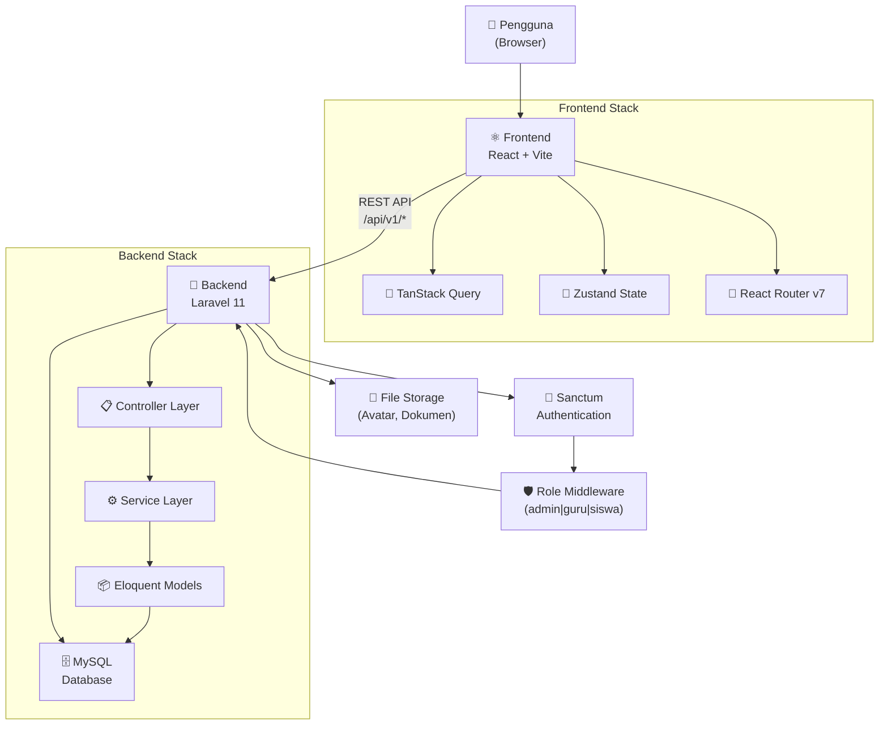
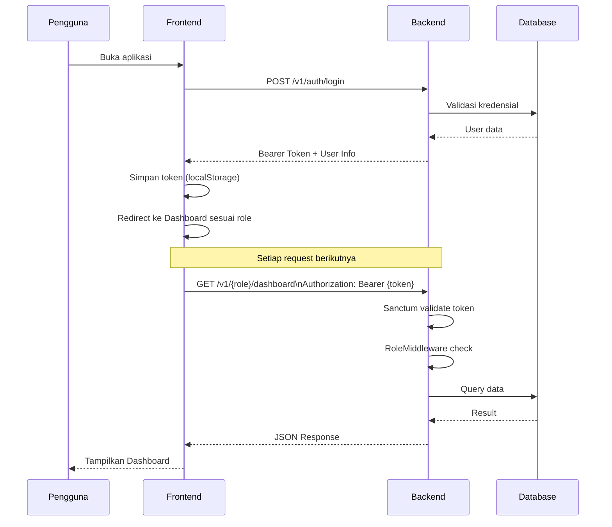
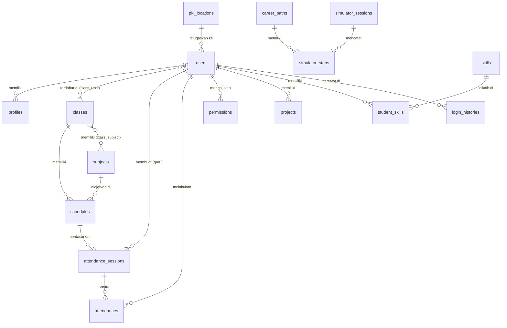

# RPL Smart Ecosystem

> Platform manajemen kelas berbasis web dengan tema Retro Futuristic untuk SMK/SMA jurusan Rekayasa Perangkat Lunak.

---

## Deskripsi Sistem

**RPL Smart Ecosystem** adalah sistem informasi manajemen sekolah berbasis web yang dirancang khusus untuk jurusan **Rekayasa Perangkat Lunak (RPL)** di tingkat SMK/SMA. Sistem ini mengintegrasikan seluruh proses administrasi akademik — mulai dari manajemen pengguna, absensi digital, penjadwalan, mata pelajaran, PKL (*Praktik Kerja Lapangan*), hingga analitik — dalam satu platform yang modern, aman, dan mudah digunakan.

### Latar Belakang

Proses administrasi di lingkungan sekolah kejuruan masih banyak bergantung pada pencatatan manual yang rentan kesalahan, tidak efisien, dan sulit dipantau secara real-time. RPL Smart Ecosystem hadir sebagai solusi digital yang menghubungkan peran **Admin**, **Guru**, dan **Siswa** dalam satu ekosistem yang terintegrasi.

### Permasalahan yang Diselesaikan

| Masalah | Solusi |
|---------|--------|
| Absensi manual tidak akurat | Absensi digital berbasis QR Code + GPS + Selfie |
| Jadwal bentrok tidak terdeteksi | Sistem deteksi konflik jadwal otomatis |
| Data PKL tidak terpusat | Manajemen lokasi PKL dengan penugasan siswa |
| Izin siswa lambat diproses | Alur persetujuan izin digital Guru → Admin |
| Tidak ada analitik kehadiran | Dashboard analitik real-time dengan grafik |
| Keamanan login lemah | Autentikasi 2FA berbasis TOTP |

### Target Pengguna

- **Admin Sekolah** — Pengelola seluruh sistem, data pengguna, dan konfigurasi
- **Guru/Wali Kelas** — Pengelola absensi, izin siswa, jadwal, dan materi
- **Siswa** — Pengisi absensi, melihat jadwal, mengajukan izin, mengelola proyek

### Ruang Lingkup Sistem

- Manajemen pengguna (Admin, Guru, Siswa)
- Manajemen kelas, mata pelajaran, dan jadwal
- Sistem absensi digital (QR Code, GPS, Selfie)
- Sistem izin dan persetujuan
- Manajemen PKL dan penugasan lokasi
- Analitik dan pelaporan
- Galeri publik proyek siswa
- Simulator jalur karier (publik)
- Pengaturan sistem

---

## Gambaran Umum Arsitektur

```
┌─────────────────────────────────────────────────────────────┐
│                    RPL Smart Ecosystem                      │
│                                                             │
│  ┌──────────────┐    REST API    ┌──────────────────────┐   │
│  │   Frontend   │ ◄────────────► │      Backend         │   │
│  │  React + Vite│                │  Laravel 11 (PHP)    │   │
│  │  Port: 5173  │                │  Port: 80 (XAMPP)    │   │
│  └──────────────┘                └──────────┬───────────┘   │
│                                             │               │
│                              ┌──────────────┼────────────┐  │
│                              │              │            │  │
│                        ┌─────┴────┐  ┌──────┴────┐       │  │
│                        │  MySQL   │  │  Storage  │       │  │
│                        │ Database │  │ (Avatars, │       │  │
│                        │          │  │  Files)   │       │  │
│                        └──────────┘  └───────────┘       │  │
└─────────────────────────────────────────────────────────────┘
```



| Layer | Teknologi | Peran |
|-------|-----------|-------|
| Frontend | React 19 + Vite 8 | Antarmuka pengguna |
| Backend | Laravel 11 (PHP 8.x) | Logika bisnis & API |
| Database | MySQL | Penyimpanan data relasional |
| Autentikasi | Laravel Sanctum | Token-based auth + 2FA |
| State Management | Zustand + TanStack Query | State global & server state |
| File Storage | Laravel Storage (local/public) | Avatar & dokumen |

---

## Fitur Utama Sistem

### 👑 Admin

- **Manajemen Pengguna** — CRUD pengguna (admin/guru/siswa), reset password, ubah role, bulk delete/export
- **Manajemen Kelas** — CRUD kelas, assign wali kelas, assign siswa, export CSV/JSON
- **Manajemen Mata Pelajaran** — CRUD mapel dengan kategori (produktif/normatif/adaptif), bulk operasi
- **Manajemen Jadwal** — CRUD jadwal, deteksi konflik otomatis, tampilan mingguan, template jadwal
- **Manajemen PKL** — CRUD lokasi PKL, penugasan siswa, approve lokasi, export data
- **Manajemen Absensi** — Lihat semua record absensi, update status manual
- **Analytics** — Analitik absensi, siswa, kelas, mapel, PKL, ekspor laporan
- **Pengumuman** — CRUD pengumuman, pin pengumuman penting
- **Pengaturan Sistem** — Konfigurasi aplikasi per seksi, preview branding, template notifikasi
- **Utilitas Sistem** — Clear cache, baca log, optimasi database, backup

### 👨‍🏫 Guru

- **Dashboard** — Ringkasan kelas, jadwal hari ini, notifikasi, statistik siswa
- **Manajemen Absensi** — Buat sesi absensi, generate QR Code, monitor real-time, verifikasi manual, bulk verify, ekspor
- **Manajemen Izin** — Lihat, approve/reject izin siswa, bulk approval, riwayat izin
- **Data Siswa** — Lihat daftar siswa per kelas, riwayat absensi per siswa
- **Pesan** — Kirim pesan antar guru atau ke siswa
- **Pengumuman** — CRUD pengumuman kelas
- **Materi Pelajaran** — Upload & kelola materi
- **Notifikasi** — Notifikasi real-time untuk aktivitas kelas

### 👨‍🎓 Siswa

- **Dashboard** — Ringkasan kehadiran, jadwal hari ini, tugas, pemberitahuan
- **Absensi Digital** — Submit absensi via kode QR dari guru + verifikasi GPS + selfie
- **Proyek** — CRUD proyek, upload log coding, export proyek
- **Keterampilan** — Lihat progress skill, log aktivitas, rekomendasi
- **Jadwal** — Lihat jadwal pelajaran
- **Nilai** — Lihat nilai per mata pelajaran
- **Izin** — Ajukan izin sakit/tidak hadir, upload bukti
- **PKL** — Lihat lokasi PKL, upload jurnal harian
- **Pengumuman** — Baca pengumuman sekolah/kelas
- **Profil** — Edit profil, upload foto, ganti password

### 🌐 Publik (Tanpa Login)

- **Landing Page** — Halaman utama sistem dengan animasi retro
- **Galeri Siswa** — Portofolio proyek siswa yang dapat diakses publik
- **Simulator Karier** — Simulasi interaktif jalur karier RPL
- **API Health Check** — Status API dan sistem

---

## Alur Sistem Lengkap



**Alur Absensi Siswa:**
1. Guru buat sesi absensi → generate kode 6 karakter
2. Guru tampilkan kode ke siswa di kelas
3. Siswa input kode di aplikasi → backend validasi
4. Siswa lakukan verifikasi GPS (koordinat harus dalam radius sekolah)
5. Siswa ambil selfie sebagai bukti kehadiran
6. Data absensi tersimpan dengan timestamp, koordinat, dan foto

---

## Struktur Folder Project

```
smart-class/
├── backend/                    # Laravel 11 API Backend
│   ├── app/
│   │   ├── Http/
│   │   │   ├── Controllers/
│   │   │   │   ├── Admin/      # Controller untuk role admin
│   │   │   │   ├── Auth/       # Controller autentikasi
│   │   │   │   ├── Public/     # Controller akses publik
│   │   │   │   ├── Student/    # Controller untuk role siswa
│   │   │   │   └── Teacher/    # Controller untuk role guru
│   │   │   └── Middleware/
│   │   │       └── RoleMiddleware.php
│   │   ├── Models/             # Eloquent ORM Models (23 model)
│   │   └── Services/           # Business logic layer (17 service)
│   ├── database/
│   │   ├── migrations/         # 42 file migrasi database
│   │   └── seeders/            # Data awal database
│   ├── routes/
│   │   └── api.php             # Definisi semua API route (731 baris)
│   └── storage/                # File upload (avatar, dokumen)
│
├── frontend/                   # React 19 + Vite 8 Frontend
│   ├── src/
│   │   ├── api/                # Axios HTTP client & API calls
│   │   ├── components/         # Komponen UI reusable
│   │   │   └── ui/             # Komponen UI dasar (retro-style)
│   │   ├── context/            # React Context (Auth, Theme)
│   │   ├── hooks/              # Custom React Hooks (15 hook)
│   │   ├── i18n/               # Internasionalisasi (ID/EN)
│   │   ├── layouts/            # Layout wrapper (Dashboard, Auth)
│   │   ├── lib/                # Utilitas dan helper functions
│   │   ├── pages/
│   │   │   ├── admin/          # Halaman khusus admin (12 halaman)
│   │   │   ├── dashboard/      # Dashboard per role
│   │   │   └── teacher/        # Halaman khusus guru (11 halaman)
│   │   ├── utils/              # Fungsi utilitas (format, validasi)
│   │   ├── routes.jsx          # Konfigurasi routing & protected routes
│   │   └── main.jsx            # Entry point aplikasi
│   ├── public/                 # Asset statis
│   └── dist/                   # Build production output
│
└── README.md                   # Dokumentasi ini
```

---

## Teknologi yang Digunakan

| Teknologi | Versi | Fungsi |
|-----------|-------|--------|
| **React** | 19.x | Library UI frontend |
| **Vite** | 8.x | Build tool & dev server |
| **React Router DOM** | 7.x | Client-side routing |
| **TanStack Query** | 5.x | Server state management & caching |
| **Zustand** | 5.x | Global client state management |
| **Axios** | 1.x | HTTP client untuk API calls |
| **Framer Motion** | 12.x | Animasi dan transisi halaman |
| **Lucide React** | 1.x | Ikon konsisten |
| **Leaflet + React Leaflet** | 1.9 / 5.x | Peta interaktif (GPS absensi) |
| **QRCode.react** | 4.x | Generate QR Code |
| **Laravel** | 11.x | PHP Framework backend |
| **Laravel Sanctum** | 4.x | API Token Authentication |
| **MySQL** | 8.x | Database relasional |
| **PHP** | 8.2+ | Bahasa pemrograman backend |
| **TailwindCSS** | 3.x | Utility-first CSS framework |
| **Radix UI** | 1.x | Komponen UI aksesibel (dialog) |

---

## Database Overview

Sistem menggunakan **42 migrasi** yang menghasilkan struktur database berikut:

### Entitas Utama

| Tabel | Fungsi |
|-------|--------|
| `users` | Data akun semua pengguna (admin/guru/siswa) |
| `profiles` | Data profil lengkap pengguna |
| `classes` | Data kelas (X RPL 1, XI RPL 2, dst) |
| `subjects` | Data mata pelajaran |
| `schedules` | Jadwal pelajaran (hari, jam, kelas, mapel, guru) |
| `attendance_sessions` | Sesi absensi yang dibuat guru |
| `attendances` | Record kehadiran per siswa per sesi |
| `permissions` | Data izin tidak hadir siswa |
| `projects` | Proyek coding siswa |
| `skills` | Daftar keterampilan |
| `student_skills` | Progress keterampilan per siswa |
| `pkl_locations` | Lokasi PKL dengan koordinat GPS |
| `career_paths` | Jalur karier (untuk simulator publik) |
| `simulator_sessions` | Sesi simulator karier |
| `messages` | Pesan antar pengguna |
| `announcements` | Pengumuman sekolah/kelas |
| `settings` | Konfigurasi sistem |
| `devices` | Device terdaftar per user |
| `login_histories` | Riwayat login untuk audit |

### Diagram ERD



---

## API Overview

Base URL: `http://localhost/api`

### Autentikasi

Semua endpoint (kecuali public dan auth login) memerlukan header:
```
Authorization: Bearer {token}
```

Token diperoleh dari response `POST /v1/auth/login`.

### Format Response

**Success:**
```json
{
  "status": "success",
  "message": "Data berhasil dimuat",
  "data": { ... }
}
```

**Error:**
```json
{
  "status": "error",
  "message": "Pesan kesalahan",
  "code": "ERROR_CODE",
  "errors": { ... }
}
```

### Grup Endpoint Utama

| Grup | Prefix | Auth | Deskripsi |
|------|--------|------|-----------|
| Public | `/v1/public` | ❌ | Landing, galeri, simulator |
| Auth | `/v1/auth` | Sebagian | Login, logout, 2FA |
| Siswa | `/v1/student` | ✅ role:siswa | Semua fitur siswa |
| Guru | `/v1/teacher` | ✅ role:guru | Semua fitur guru |
| Admin | `/v1/admin` | ✅ role:admin | Semua fitur admin |
| Realtime | `/v1/realtime` | ✅ | WebSocket (future) |

Dokumentasi lengkap: `GET /api/docs`

---

## Hak Akses Role

| Fitur | Admin | Guru | Siswa | Publik |
|-------|:-----:|:----:|:-----:|:------:|
| Manajemen Pengguna | ✅ | ❌ | ❌ | ❌ |
| Manajemen Kelas | ✅ | ❌ | ❌ | ❌ |
| Manajemen Mapel | ✅ | ❌ | ❌ | ❌ |
| Manajemen Jadwal | ✅ | ❌ | ❌ | ❌ |
| Manajemen PKL | ✅ | ❌ | ❌ | ❌ |
| Pengaturan Sistem | ✅ | ❌ | ❌ | ❌ |
| Analytics Sistem | ✅ | ❌ | ❌ | ❌ |
| Buat Sesi Absensi | ❌ | ✅ | ❌ | ❌ |
| Generate QR Absensi | ❌ | ✅ | ❌ | ❌ |
| Approve Izin Siswa | ❌ | ✅ | ❌ | ❌ |
| Kirim Materi | ❌ | ✅ | ❌ | ❌ |
| Submit Absensi | ❌ | ❌ | ✅ | ❌ |
| Ajukan Izin | ❌ | ❌ | ✅ | ❌ |
| Kelola Proyek | ❌ | ❌ | ✅ | ❌ |
| Upload Jurnal PKL | ❌ | ❌ | ✅ | ❌ |
| Lihat Galeri | ✅ | ✅ | ✅ | ✅ |
| Simulator Karier | ✅ | ✅ | ✅ | ✅ |
| Ekspor Absensi | ✅ | ✅ | ❌ | ❌ |

---

## Workflow Development

### Branching Strategy

```
main                    ← Production-ready branch
└── feature/{nama}      ← Fitur baru
└── fix/{nama}          ← Perbaikan bug
└── hotfix/{nama}       ← Perbaikan mendesak
```

### Alur Kerja

```
1. git checkout -b feature/nama-fitur
2. Kerjakan perubahan
3. git add . && git commit -m "feat: deskripsi singkat"
4. git push origin feature/nama-fitur
5. Buat Pull Request ke main
6. Code Review
7. Merge setelah approval
```

### Konvensi Commit (Conventional Commits)

| Prefix | Kapan Digunakan |
|--------|-----------------|
| `feat:` | Fitur baru |
| `fix:` | Perbaikan bug |
| `refactor:` | Refactoring tanpa fitur baru |
| `perf:` | Optimasi performa |
| `chore:` | Tugas maintenance |
| `test:` | Penambahan/perubahan test |
| `docs:` | Perubahan dokumentasi |

---

## Environment Variables

### Backend (`backend/.env`)

| Variable | Contoh | Fungsi |
|----------|--------|--------|
| `APP_NAME` | `RPL Smart Ecosystem` | Nama aplikasi |
| `APP_ENV` | `local` | Environment (local/production) |
| `APP_KEY` | `base64:...` | Enkripsi key Laravel |
| `APP_DEBUG` | `true` | Mode debug |
| `APP_URL` | `http://localhost` | URL dasar aplikasi |
| `DB_CONNECTION` | `mysql` | Driver database |
| `DB_HOST` | `127.0.0.1` | Host database |
| `DB_PORT` | `3306` | Port database |
| `DB_DATABASE` | `smart_class` | Nama database |
| `DB_USERNAME` | `root` | Username database |
| `DB_PASSWORD` | _(kosong)_ | Password database |
| `SANCTUM_STATEFUL_DOMAINS` | `localhost:5173` | Domain frontend |
| `FILESYSTEM_DISK` | `public` | Disk penyimpanan file |
| `QUEUE_CONNECTION` | `sync` | Driver antrian |
| `SESSION_DRIVER` | `database` | Driver sesi |

### Frontend (`frontend/.env`)

| Variable | Contoh | Fungsi |
|----------|--------|--------|
| `VITE_API_URL` | `http://localhost/api` | Base URL API backend |
| `VITE_APP_NAME` | `RPL Smart Ecosystem` | Nama aplikasi |
| `VITE_APP_VERSION` | `2.0.0` | Versi aplikasi |

---

## Instalasi Cepat

### Prasyarat

- PHP >= 8.2
- Composer
- Node.js >= 18 + npm
- MySQL / MariaDB
- XAMPP (rekomendasi untuk development lokal)

### Langkah Instalasi

```bash
# 1. Clone repository
git clone https://github.com/dimaspray7i/smart-class.git
cd smart-class

# 2. Setup Backend
cd backend
composer install
cp .env.example .env
php artisan key:generate

# 3. Konfigurasi database di .env
# DB_DATABASE=smart_class
# DB_USERNAME=root
# DB_PASSWORD=

# 4. Buat database dan jalankan migrasi
php artisan migrate
php artisan db:seed

# 5. Setup symlink storage
php artisan storage:link

# 6. Setup Frontend (tab terminal baru)
cd ../frontend
npm install
cp .env.example .env
# Set VITE_API_URL=http://localhost/api

# 7. Jalankan Frontend
npm run dev

# Backend berjalan via XAMPP di http://localhost
# Frontend berjalan di http://localhost:5173
```

---

## Deployment

### Development

```bash
# Backend: Jalankan via XAMPP (Apache + PHP + MySQL)
# Frontend:
npm run dev
```

### Production

```bash
# Backend: Deploy ke web server dengan PHP
php artisan config:cache
php artisan route:cache
php artisan view:cache

# Frontend: Build dan deploy static files
npm run build
# Upload folder dist/ ke CDN atau web server
```

---

## Logging dan Monitoring

- **Error Log** — Tersimpan di `backend/storage/logs/laravel.log`
- **Login History** — Setiap login tercatat di tabel `login_histories` (user, IP, device, timestamp)
- **Audit Trail** — Aktivitas penting dicatat melalui service layer
- **System Log API** — Admin dapat melihat 100 baris log terakhir via `GET /v1/admin/logs/recent`
- **Health Check** — `GET /api/health` untuk status API; `GET /api/status` untuk status komponen

---

## Security

| Aspek | Implementasi |
|-------|-------------|
| **Token Auth** | Laravel Sanctum Bearer Token |
| **RBAC** | RoleMiddleware — `role:admin\|guru\|siswa` |
| **Password Hashing** | Bcrypt via Laravel default |
| **2FA** | TOTP berbasis `pragmarx/google2fa` |
| **CORS** | Dikonfigurasi di `config/cors.php` |
| **IDOR Protection** | Validasi ownership di service layer |
| **QR Security** | Siswa dilarang generate QR (403 Forbidden) |
| **Input Validation** | Laravel Form Requests + Frontend validation |
| **Rate Limiting** | Laravel Throttle Middleware |

---

## Troubleshooting

| # | Masalah | Solusi |
|---|---------|--------|
| 1 | `php artisan migrate` gagal | Pastikan MySQL berjalan dan kredensial `.env` benar |
| 2 | Frontend tidak bisa konek API | Cek `VITE_API_URL` dan pastikan CORS allow localhost:5173 |
| 3 | Token expired terus-menerus | Cek `SESSION_LIFETIME` di `.env` backend |
| 4 | Upload avatar gagal | Jalankan `php artisan storage:link` dan cek permission folder `storage/` |
| 5 | Login 2FA selalu salah | Sinkronkan waktu server dengan NTP; 2FA sensitif terhadap timezone |
| 6 | QR Code tidak muncul | Cek apakah sesi absensi sudah dibuat guru sebelum generate QR |
| 7 | GPS tidak terdeteksi | Izinkan akses lokasi di browser; gunakan HTTPS untuk production |
| 8 | Halaman admin blank | Cek console browser untuk error JavaScript; pastikan `npm run build` sukses |
| 9 | Data tidak muncul di tabel | Pastikan `php artisan db:seed` sudah dijalankan |
| 10 | Role middleware 403 | Pastikan user memiliki field `role` yang valid (admin/guru/siswa) |
| 11 | `npm run dev` port bentrok | Ubah port di `vite.config.js` atau kill proses di port 5173 |
| 12 | Composer install gagal | Pastikan PHP extension: `ext-mbstring`, `ext-xml`, `ext-curl` aktif |
| 13 | Migration rollback error | Jalankan `php artisan migrate:fresh --seed` (⚠️ hapus semua data!) |
| 14 | Email reset password tidak terkirim | Konfigurasi `MAIL_*` di `.env` dengan SMTP yang valid |
| 15 | `php artisan key:generate` tidak berjalan | Pastikan file `.env` ada; copy dari `.env.example` |
| 16 | Session login hilang setelah refresh | Cek `SANCTUM_STATEFUL_DOMAINS` sudah include domain frontend |
| 17 | Error `Class not found` di Laravel | Jalankan `composer dump-autoload` |
| 18 | Build frontend gagal | Cek error di terminal; biasanya import path salah |
| 19 | Database seed error duplikat | Jalankan `php artisan db:seed --force` atau truncate tabel terlebih dahulu |
| 20 | API health check error 500 | Cek `APP_KEY` sudah di-generate; restart Apache XAMPP |

---

## Roadmap

### Jangka Pendek (0–3 Bulan)
- [ ] Notifikasi push browser (Web Push API)
- [ ] Fitur chat real-time (WebSocket/Pusher)
- [ ] Export laporan ke format PDF
- [ ] Dark mode toggle

### Jangka Menengah (3–6 Bulan)
- [ ] Aplikasi mobile (React Native)
- [ ] Integrasi sistem nilai (raport digital)
- [ ] Fingerprint absensi
- [ ] Multi-bahasa (ID/EN)

### Jangka Panjang (6–12 Bulan)
- [ ] AI rekomendasi jalur karier siswa
- [ ] Dashboard orang tua/wali
- [ ] Integrasi Google Classroom
- [ ] SaaS multi-sekolah

---

## Kontributor

| Nama | Role |
|------|------|
| [@dimaspray7i](https://github.com/dimaspray7i) | Full Stack Developer |

---

## Lisensi

Project ini bersifat privat dan dikembangkan untuk keperluan akademik/internal SMK jurusan RPL. Seluruh hak cipta dilindungi.

---

> _"Bukan sekadar aplikasi sekolah — ini ekosistem digital untuk generasi RPL masa depan."_ 🚀
