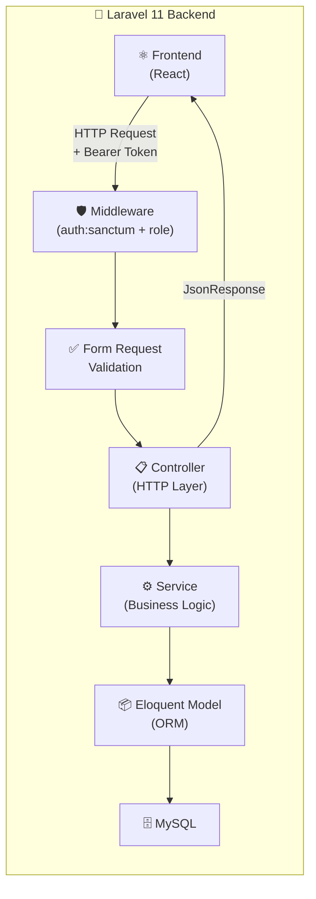

# Backend — RPL Smart Ecosystem

> REST API berbasis Laravel 11 (PHP) untuk sistem manajemen kelas RPL dengan autentikasi Sanctum, RBAC, dan arsitektur berlapis Service-Controller.

---

## Deskripsi Backend

Backend RPL Smart Ecosystem dibangun dengan **Laravel 11** menggunakan arsitektur berlapis: **Controller → Service → Model → Database**. API ini menyajikan seluruh fungsionalitas sistem (autentikasi, manajemen pengguna, absensi, jadwal, PKL, analitik, dll.) kepada frontend React melalui REST API berformat JSON.

Autentikasi menggunakan **Laravel Sanctum** dengan Bearer Token. Otorisasi menggunakan **Role-Based Access Control (RBAC)** melalui middleware `RoleMiddleware` dengan tiga peran: `admin`, `guru`, dan `siswa`.

---

## Arsitektur Backend



### Lapisan Arsitektur

| Layer | Lokasi | Tanggung Jawab |
|-------|--------|----------------|
| **Routing** | `routes/api.php` | Definisi endpoint, grouping, middleware |
| **Middleware** | `app/Http/Middleware/` | Auth, role check, rate limiting |
| **Controller** | `app/Http/Controllers/` | Terima request, kembalikan response JSON |
| **Service** | `app/Services/` | Logika bisnis, query kompleks, kalkulasi |
| **Model** | `app/Models/` | Eloquent ORM, relasi, mutator |
| **Database** | `database/migrations/` | Skema tabel, constraint, index |

---

## Struktur Folder Backend

```
backend/
├── app/
│   ├── Http/
│   │   ├── Controllers/
│   │   │   ├── Admin/                  # 10 Controller role admin
│   │   │   │   ├── AnalyticsController.php     # Analitik sistem
│   │   │   │   ├── AnnouncementController.php  # Manajemen pengumuman
│   │   │   │   ├── AttendanceController.php    # Admin absensi view
│   │   │   │   ├── ClassController.php         # Manajemen kelas
│   │   │   │   ├── DashboardController.php     # Dashboard admin
│   │   │   │   ├── PklLocationController.php   # Manajemen PKL
│   │   │   │   ├── ScheduleController.php      # Manajemen jadwal
│   │   │   │   ├── SettingController.php       # Pengaturan sistem
│   │   │   │   ├── SubjectController.php       # Manajemen mapel
│   │   │   │   └── UserController.php          # Manajemen pengguna
│   │   │   │
│   │   │   ├── Auth/
│   │   │   │   └── AuthController.php          # Login, logout, 2FA, token
│   │   │   │
│   │   │   ├── Public/
│   │   │   │   ├── LandingController.php       # Landing page data
│   │   │   │   ├── StudentGalleryController.php # Galeri publik
│   │   │   │   └── SimulatorController.php     # Simulator karier
│   │   │   │
│   │   │   ├── Student/                # 12 Controller role siswa
│   │   │   │   ├── AnnouncementController.php
│   │   │   │   ├── AttendanceController.php    # Submit & history absensi
│   │   │   │   ├── DashboardController.php
│   │   │   │   ├── GradeController.php
│   │   │   │   ├── PermissionController.php    # Ajukan izin
│   │   │   │   ├── PklController.php           # Jurnal PKL
│   │   │   │   ├── ProfileController.php
│   │   │   │   ├── ProjectController.php       # CRUD proyek
│   │   │   │   ├── ScheduleController.php
│   │   │   │   ├── SettingsController.php
│   │   │   │   ├── SkillController.php
│   │   │   │   └── TaskController.php
│   │   │   │
│   │   │   └── Teacher/                # 6 Controller role guru
│   │   │       ├── AnnouncementController.php
│   │   │       ├── AttendanceController.php    # Sesi absensi & QR
│   │   │       ├── DashboardController.php
│   │   │       ├── MaterialController.php
│   │   │       ├── MessageController.php
│   │   │       └── PermissionController.php    # Approve/reject izin
│   │   │
│   │   └── Middleware/
│   │       └── RoleMiddleware.php      # Validasi role user
│   │
│   ├── Models/                         # 23 Eloquent Models
│   │   ├── User.php                    # Model utama pengguna
│   │   ├── Profile.php                 # Profil detail pengguna
│   │   ├── ClassModel.php              # Model kelas
│   │   ├── Subject.php                 # Mata pelajaran
│   │   ├── Schedule.php                # Jadwal pelajaran
│   │   ├── Attendance.php              # Record kehadiran
│   │   ├── AttendanceSession.php       # Sesi absensi guru
│   │   ├── AttendanceRecord.php        # Detail record absensi
│   │   ├── Permission.php              # Izin tidak hadir
│   │   ├── PklLocation.php             # Lokasi PKL
│   │   ├── Project.php                 # Proyek siswa
│   │   ├── CodingLog.php               # Log coding proyek
│   │   ├── Skill.php                   # Keterampilan
│   │   ├── StudentSkill.php            # Progress skill siswa
│   │   ├── CareerPath.php              # Jalur karier
│   │   ├── SimulatorSession.php        # Sesi simulator
│   │   ├── SimulatorStep.php           # Langkah simulator
│   │   ├── Message.php                 # Pesan
│   │   ├── Announcement.php            # Pengumuman
│   │   ├── Material.php                # Materi pelajaran
│   │   ├── Device.php                  # Device terdaftar
│   │   ├── LoginHistory.php            # Riwayat login
│   │   └── Settings.php                # Konfigurasi sistem
│   │
│   ├── Providers/
│   │   └── AppServiceProvider.php
│   │
│   └── Services/                       # 17 Service classes
│       ├── AdminService.php            # Logika dashboard admin
│       ├── AnalyticsService.php        # Kalkulasi analitik
│       ├── AttendanceExportService.php # Export data absensi
│       ├── AttendanceService.php       # Logika absensi (terbesar: 84KB)
│       ├── AuthService.php             # Logika autentikasi + 2FA
│       ├── ClassService.php            # Logika manajemen kelas
│       ├── LandingService.php          # Data landing page publik
│       ├── PermissionService.php       # Logika izin siswa
│       ├── ProjectService.php          # Logika proyek siswa
│       ├── ScheduleService.php         # Logika jadwal & konflik
│       ├── SimulatorService.php        # Logika simulator karier
│       ├── SkillService.php            # Logika keterampilan
│       ├── StudentGalleryService.php   # Data galeri publik
│       ├── StudentService.php          # Data siswa untuk guru
│       ├── SubjectService.php          # Logika mata pelajaran
│       ├── TeacherService.php          # Dashboard & notif guru
│       └── UserService.php             # CRUD & manajemen user
│
├── database/
│   ├── migrations/                     # 42 file migrasi
│   ├── seeders/
│   │   └── DatabaseSeeder.php         # Seeder utama
│   └── factories/                      # Factory untuk testing
│
├── routes/
│   └── api.php                         # Semua route API (731 baris)
│
├── storage/
│   ├── app/public/                     # File yang diakses publik (avatar, dll)
│   └── logs/
│       └── laravel.log                 # Log aplikasi
│
├── config/
│   ├── auth.php                        # Konfigurasi auth & guards
│   ├── cors.php                        # Konfigurasi CORS
│   ├── database.php                    # Konfigurasi database
│   └── sanctum.php                     # Konfigurasi Sanctum
│
├── .env                                # Environment variables (jangan di-commit!)
├── .env.example                        # Template environment variables
├── composer.json                       # PHP dependencies
└── artisan                             # CLI Laravel
```

---

## Request Lifecycle

Setiap HTTP request melewati pipeline berikut:

```
1. HTTP Request masuk ke Apache/Nginx
         ↓
2. Laravel Bootstrap (Service Providers)
         ↓
3. Route matching di routes/api.php
         ↓
4. Global Middleware: api (throttle, CORS, JSON)
         ↓
5. Auth Middleware: auth:sanctum
   → Validasi Bearer Token
   → Load user dari database
         ↓
6. Role Middleware: RoleMiddleware
   → Cek user->role vs required role
   → Return 403 jika tidak sesuai
         ↓
7. Form Request Validation (jika ada)
   → Validasi input request
   → Return 422 jika gagal
         ↓
8. Controller method dipanggil
   → Terima Request, ekstrak data
   → Panggil Service
         ↓
9. Service Layer
   → Logika bisnis
   → Panggil Model/Eloquent
         ↓
10. Eloquent Model
    → Query ke MySQL
    → Return hasil ke Service
         ↓
11. Controller
    → Format response JSON
    → Return JsonResponse
         ↓
12. HTTP Response ke client
```

---

## Authentication

### Login

```
POST /api/v1/auth/login
POST /api/v1/auth/login/retro  (alias dengan format retro)
```

**Request Body:**
```json
{
  "email": "admin@sekolah.com",
  "password": "password123"
}
```

**Response:**
```json
{
  "status": "success",
  "message": "Login berhasil",
  "data": {
    "token": "1|abc123...",
    "user": {
      "id": 1,
      "name": "Admin Sekolah",
      "email": "admin@sekolah.com",
      "role": "admin"
    }
  }
}
```

### Two-Factor Authentication (2FA)

TOTP berbasis library `pragmarx/google2fa`:

```
POST /api/v1/auth/2fa/enable   → Aktifkan 2FA, dapat QR secret
POST /api/v1/auth/2fa/verify   → Verifikasi kode TOTP 6 digit
POST /api/v1/auth/2fa/disable  → Nonaktifkan 2FA
```

### Token Management

```
POST /api/v1/auth/logout          → Revoke token saat ini
POST /api/v1/auth/token/refresh   → Perpanjang sesi token
GET  /api/v1/auth/me              → Data user aktif
GET  /api/v1/auth/devices         → Daftar device terdaftar
DELETE /api/v1/auth/devices/{id}  → Cabut akses device
```

---

## Authorization (RBAC)

### RoleMiddleware

File: [`app/Http/Middleware/RoleMiddleware.php`](file:///c:/xampp/htdocs/smart-class/backend/app/Http/Middleware/RoleMiddleware.php)

```php
// Penggunaan di routes/api.php
Route::middleware(['auth:sanctum', 'role:admin'])->group(function () { ... });
Route::middleware(['auth:sanctum', 'role:guru'])->group(function () { ... });
Route::middleware(['auth:sanctum', 'role:siswa'])->group(function () { ... });
Route::middleware(['auth:sanctum', 'role:guru|admin'])->group(function () { ... });
```

Middleware membaca `$user->role` dari model `User` dan membandingkan dengan role yang diizinkan. Jika tidak sesuai, mengembalikan `403 Forbidden`.

### Matriks RBAC

| Resource | admin | guru | siswa |
|----------|:-----:|:----:|:-----:|
| Dashboard sendiri | ✅ | ✅ | ✅ |
| Manajemen User | ✅ CRUD | ❌ | ❌ |
| Manajemen Kelas | ✅ CRUD | ❌ | ❌ |
| Manajemen Mapel | ✅ CRUD | ❌ | ❌ |
| Manajemen Jadwal | ✅ CRUD | ❌ | ❌ |
| Manajemen PKL | ✅ CRUD | ❌ | ❌ |
| Pengaturan Sistem | ✅ | ❌ | ❌ |
| Analitik Sistem | ✅ | ❌ | ❌ |
| Buat Sesi Absensi | ❌ | ✅ | ❌ |
| Generate QR | ❌ | ✅ | ❌ |
| Approve Izin | ❌ | ✅ | ❌ |
| Upload Materi | ❌ | ✅ | ❌ |
| Submit Absensi | ❌ | ❌ | ✅ |
| Ajukan Izin | ❌ | ❌ | ✅ |
| CRUD Proyek | ❌ | ❌ | ✅ |
| Upload Jurnal PKL | ❌ | ❌ | ✅ |
| Export Absensi | ✅ | ✅ | ❌ |

---

## Database

### Tabel Utama

#### `users`
Data akun semua pengguna sistem.

| Kolom | Tipe | Deskripsi |
|-------|------|-----------|
| `id` | bigint | Primary key |
| `name` | varchar | Nama lengkap |
| `email` | varchar | Email (unique) |
| `password` | varchar | Password (bcrypt) |
| `role` | enum | `admin` / `guru` / `siswa` |
| `is_active` | boolean | Status aktif akun |
| `two_factor_secret` | text | Secret TOTP 2FA |
| `two_factor_enabled` | boolean | Status 2FA |

#### `profiles`
Detail profil pengguna (1-to-1 dengan `users`).

| Kolom | Tipe | Deskripsi |
|-------|------|-----------|
| `user_id` | bigint | FK ke `users` |
| `avatar` | varchar | Path foto profil |
| `phone` | varchar | Nomor telepon |
| `address` | text | Alamat |
| `class_level` | varchar | Tingkat kelas (X/XI/XII) |
| `nis` | varchar | NIS siswa |
| `nip` | varchar | NIP guru |
| `pkl_location_id` | bigint | FK ke `pkl_locations` |

#### `classes`
Data kelas sekolah.

| Kolom | Tipe | Deskripsi |
|-------|------|-----------|
| `id` | bigint | Primary key |
| `name` | varchar | Nama kelas (X RPL 1) |
| `grade` | varchar | Tingkat (X/XI/XII) |
| `wali_kelas_id` | bigint | FK guru wali kelas |
| `academic_year` | varchar | Tahun ajaran |

#### `attendance_sessions`
Sesi absensi yang dibuat guru.

| Kolom | Tipe | Deskripsi |
|-------|------|-----------|
| `id` | bigint | Primary key |
| `class_id` | bigint | FK ke `classes` |
| `subject_id` | bigint | FK ke `subjects` |
| `teacher_id` | bigint | FK guru pembuat |
| `session_code` | varchar(6) | Kode 6 karakter untuk siswa |
| `date` | date | Tanggal sesi |
| `start_time` | time | Jam mulai |
| `end_time` | time | Jam selesai |
| `status` | enum | `active` / `closed` |
| `enable_geofence` | boolean | Aktifkan validasi GPS |
| `location` | json | Koordinat lokasi geofence |
| `is_manual` | boolean | Sesi manual (tanpa jadwal) |
| `notes` | text | Catatan sesi |

#### `attendances`
Record kehadiran siswa per sesi.

| Kolom | Tipe | Deskripsi |
|-------|------|-----------|
| `id` | bigint | Primary key |
| `session_id` | bigint | FK ke `attendance_sessions` |
| `student_id` | bigint | FK ke `users` (siswa) |
| `status` | enum | `hadir` / `izin` / `sakit` / `alpha` |
| `check_in_time` | datetime | Waktu check-in |
| `latitude` | decimal | Koordinat GPS lat |
| `longitude` | decimal | Koordinat GPS lon |
| `selfie_path` | varchar | Path foto selfie |
| `verified_by` | bigint | FK guru yang verifikasi |
| `is_manual` | boolean | Diinput manual oleh guru |

#### `permissions`
Izin tidak hadir siswa.

| Kolom | Tipe | Deskripsi |
|-------|------|-----------|
| `id` | bigint | Primary key |
| `student_id` | bigint | FK siswa pengaju |
| `teacher_id` | bigint | FK guru penerima (nullable) |
| `type` | enum | `izin` / `sakit` |
| `date_from` | date | Tanggal mulai |
| `date_to` | date | Tanggal selesai |
| `reason` | text | Alasan izin |
| `attachment_url` | varchar | Path bukti (surat dokter, dll) |
| `status` | enum | `pending` / `approved` / `rejected` |

#### `pkl_locations`
Lokasi tempat PKL.

| Kolom | Tipe | Deskripsi |
|-------|------|-----------|
| `id` | bigint | Primary key |
| `name` | varchar | Nama perusahaan/lokasi |
| `address` | text | Alamat lengkap |
| `latitude` | decimal | Koordinat GPS lat |
| `longitude` | decimal | Koordinat GPS lon |
| `radius_meters` | integer | Radius geofence (meter) |
| `status` | enum | `pending` / `approved` |
| `capacity` | integer | Kapasitas siswa |

---

## API Documentation

### Autentikasi

| Method | Endpoint | Deskripsi | Auth |
|--------|----------|-----------|------|
| POST | `/v1/auth/login` | Login standar | ❌ |
| POST | `/v1/auth/login/retro` | Login tema retro | ❌ |
| POST | `/v1/auth/logout` | Logout (revoke token) | ✅ |
| GET | `/v1/auth/me` | Data user aktif | ✅ |
| PUT | `/v1/auth/profile` | Update profil | ✅ |
| POST | `/v1/auth/profile/avatar` | Upload avatar | ✅ |
| POST | `/v1/auth/2fa/enable` | Aktifkan 2FA | ✅ |
| POST | `/v1/auth/2fa/verify` | Verifikasi kode 2FA | ✅ |
| POST | `/v1/auth/token/refresh` | Refresh token | ✅ |

### Admin — Pengguna

| Method | Endpoint | Deskripsi |
|--------|----------|-----------|
| GET | `/v1/admin/users` | List semua pengguna |
| POST | `/v1/admin/users` | Buat pengguna baru |
| GET | `/v1/admin/users/{id}` | Detail pengguna |
| PUT | `/v1/admin/users/{id}` | Update pengguna |
| DELETE | `/v1/admin/users/{id}` | Hapus pengguna |
| POST | `/v1/admin/users/{id}/reset-password` | Reset password |
| PATCH | `/v1/admin/users/{id}/role` | Ubah role |
| POST | `/v1/admin/users/bulk/delete` | Hapus massal |
| POST | `/v1/admin/users/bulk/export` | Export massal |
| GET | `/v1/admin/users/export/csv` | Export CSV |

### Admin — Kelas

| Method | Endpoint | Deskripsi |
|--------|----------|-----------|
| GET | `/v1/admin/classes` | List kelas |
| POST | `/v1/admin/classes` | Buat kelas |
| GET | `/v1/admin/classes/{id}` | Detail kelas |
| PUT | `/v1/admin/classes/{id}` | Update kelas |
| DELETE | `/v1/admin/classes/{id}` | Hapus kelas |
| GET | `/v1/admin/classes/export/csv` | Export CSV |
| POST | `/v1/admin/classes/bulk/delete` | Hapus massal |

### Admin — Mata Pelajaran

| Method | Endpoint | Deskripsi |
|--------|----------|-----------|
| GET | `/v1/admin/subjects` | List mapel |
| POST | `/v1/admin/subjects` | Buat mapel |
| GET | `/v1/admin/subjects/{id}` | Detail mapel |
| PUT | `/v1/admin/subjects/{id}` | Update mapel |
| DELETE | `/v1/admin/subjects/{id}` | Hapus mapel |
| GET | `/v1/admin/subjects/categories` | Daftar kategori mapel |
| GET | `/v1/admin/subjects/analytics` | Analitik mapel |
| GET | `/v1/admin/subjects/export` | Export CSV |

### Admin — Jadwal

| Method | Endpoint | Deskripsi |
|--------|----------|-----------|
| GET | `/v1/admin/schedules` | List jadwal |
| POST | `/v1/admin/schedules` | Buat jadwal |
| GET | `/v1/admin/schedules/{id}` | Detail jadwal |
| PUT | `/v1/admin/schedules/{id}` | Update jadwal |
| DELETE | `/v1/admin/schedules/{id}` | Hapus jadwal |
| POST | `/v1/admin/schedules/check-conflict` | Cek konflik jadwal |
| GET | `/v1/admin/schedules/weekly-view` | Tampilan mingguan |
| GET | `/v1/admin/schedules/by-teacher/{id}` | Jadwal per guru |
| GET | `/v1/admin/schedules/by-class/{id}` | Jadwal per kelas |

### Admin — PKL

| Method | Endpoint | Deskripsi |
|--------|----------|-----------|
| GET | `/v1/admin/pkl-locations` | List lokasi PKL |
| POST | `/v1/admin/pkl-locations` | Buat lokasi PKL |
| PUT | `/v1/admin/pkl-locations/{id}` | Update lokasi |
| DELETE | `/v1/admin/pkl-locations/{id}` | Hapus lokasi |
| PATCH | `/v1/admin/pkl-locations/{id}/approve` | Approve lokasi |
| GET | `/v1/admin/pkl/students` | Daftar siswa PKL |
| POST | `/v1/admin/pkl/assign` | Assign siswa ke lokasi |
| POST | `/v1/admin/pkl/unassign/{studentId}` | Batalkan penugasan |

### Admin — Pengaturan

| Method | Endpoint | Deskripsi |
|--------|----------|-----------|
| GET | `/v1/admin/settings` | Ambil semua pengaturan |
| PUT | `/v1/admin/settings` | Update semua pengaturan |
| PUT | `/v1/admin/settings/section/{section}` | Update per seksi |
| POST | `/v1/admin/settings/reset` | Reset ke default |
| GET | `/v1/admin/settings/categories` | Daftar kategori setting |
| GET | `/v1/admin/settings/export/json` | Export JSON |

### Admin — Analitik

| Method | Endpoint | Deskripsi |
|--------|----------|-----------|
| GET | `/v1/admin/analytics` | Ringkasan analitik |
| GET | `/v1/admin/analytics/attendance` | Analitik absensi |
| GET | `/v1/admin/analytics/students` | Analitik siswa |
| GET | `/v1/admin/analytics/classes` | Analitik kelas |
| GET | `/v1/admin/analytics/subjects` | Analitik mapel |
| GET | `/v1/admin/analytics/pkl` | Analitik PKL |
| GET | `/v1/admin/analytics/realtime` | Data real-time |
| GET | `/v1/admin/analytics/export` | Export laporan |

### Guru — Dashboard & Absensi

| Method | Endpoint | Deskripsi |
|--------|----------|-----------|
| GET | `/v1/teacher/dashboard` | Dashboard guru |
| GET | `/v1/teacher/schedule/today` | Jadwal hari ini |
| GET | `/v1/teacher/notifications` | Notifikasi guru |
| PATCH | `/v1/teacher/notifications/{id}/read` | Tandai notif dibaca |
| POST | `/v1/teacher/attendance/session/create` | Buat sesi absensi |
| POST | `/v1/teacher/attendance/session/{id}/generate-code` | Generate kode QR |
| POST | `/v1/teacher/attendance/session/{id}/close` | Tutup sesi |
| GET | `/v1/teacher/attendance/session/{id}/monitor` | Monitor real-time |
| PATCH | `/v1/teacher/attendance/{id}/verify` | Verifikasi manual |
| POST | `/v1/teacher/attendance/bulk/verify` | Bulk verifikasi |
| GET | `/v1/teacher/attendance/history` | Riwayat sesi |
| GET | `/v1/teacher/attendance/export` | Export absensi |

### Guru — Izin

| Method | Endpoint | Deskripsi |
|--------|----------|-----------|
| GET | `/v1/teacher/permissions` | List izin siswa |
| POST | `/v1/teacher/permissions` | Buat izin untuk siswa |
| PATCH | `/v1/teacher/permissions/{id}/approve` | Approve izin |
| PATCH | `/v1/teacher/permissions/{id}/reject` | Reject izin |
| POST | `/v1/teacher/permissions/bulk/approve` | Bulk approve |
| POST | `/v1/teacher/permissions/bulk/reject` | Bulk reject |
| GET | `/v1/teacher/permissions/history` | Riwayat izin |

### Siswa — Absensi

| Method | Endpoint | Deskripsi |
|--------|----------|-----------|
| POST | `/v1/student/attendance` | Submit absensi |
| GET | `/v1/student/attendance/today` | Status absensi hari ini |
| GET | `/v1/student/attendance/history` | Riwayat absensi |
| GET | `/v1/student/attendance/stats` | Statistik kehadiran |
| POST | `/v1/student/attendance/verify-code` | Verifikasi kode sesi |
| POST | `/v1/student/attendance/verify-location` | Verifikasi GPS |
| POST | `/v1/student/attendance/selfie/verify` | Verifikasi selfie |
| GET | `/v1/student/attendance/qr/generate` | **403 FORBIDDEN** (siswa dilarang) |

### Publik

| Method | Endpoint | Deskripsi |
|--------|----------|-----------|
| GET | `/v1/public/landing` | Data landing page |
| GET | `/v1/public/stats` | Statistik sistem |
| GET | `/v1/public/gallery` | Galeri proyek siswa |
| GET | `/v1/public/gallery/{slug}` | Detail portofolio |
| GET | `/v1/public/simulator/paths` | Jalur karier |
| POST | `/v1/public/simulator/sessions` | Mulai simulasi |
| GET | `/api/health` | Health check |
| GET | `/api/status` | Status komponen |
| GET | `/api/docs` | Dokumentasi API |

---

## Middleware

### `auth:sanctum`
Middleware bawaan Laravel Sanctum yang memvalidasi Bearer Token di header `Authorization`. Jika token tidak valid atau expired → `401 Unauthorized`.

### `RoleMiddleware`
Custom middleware yang memvalidasi field `role` dari user yang sedang login terhadap role yang diizinkan oleh route. Jika tidak sesuai → `403 Forbidden`.

**Registrasi:** Di `bootstrap/app.php` sebagai alias `role`.

### `throttle:api`
Rate limiting bawaan Laravel — membatasi jumlah request per menit per IP/user.

### `api`
Global middleware group yang meliputi:
- `SubstituteBindings` — Route model binding
- `ThrottleRequests` — Rate limiting
- Response format JSON

---

## Validation Rules

Form Requests digunakan di beberapa endpoint untuk validasi input:

### Login
```php
'email'    => 'required|email',
'password' => 'required|string|min:6',
```

### Buat User
```php
'name'     => 'required|string|min:3|max:100',
'email'    => 'required|email|unique:users',
'password' => 'required|string|min:8',
'role'     => 'required|in:admin,guru,siswa',
```

### Buat Sesi Absensi (Guru)
```php
'class_id'    => 'required|exists:classes,id',
'subject_id'  => 'required|exists:subjects,id',
'date'        => 'required|date',   // validasi timezone WIB via Carbon
'start_time'  => 'required|date_format:H:i',
'end_time'    => 'required|date_format:H:i|after:start_time',
```

### Submit Absensi (Siswa)
```php
'session_code' => 'required|string|size:6',
'latitude'     => 'required|numeric|between:-90,90',
'longitude'    => 'required|numeric|between:-180,180',
'selfie'       => 'required|image|max:5120', // max 5MB
```

---

## Error Handling

Semua error dikembalikan dalam format JSON konsisten:

```json
{
  "status": "error",
  "message": "Pesan error yang dapat dibaca pengguna",
  "code": "ERROR_CODE_CONSTANT",
  "errors": {
    "field": ["Pesan validasi per field"]
  }
}
```

**HTTP Status Code yang Digunakan:**

| Code | Kondisi |
|------|---------|
| `200` | Request berhasil |
| `201` | Resource berhasil dibuat |
| `400` | Request tidak valid |
| `401` | Token tidak ada / invalid / expired |
| `403` | Role tidak memiliki akses |
| `404` | Resource tidak ditemukan |
| `422` | Validasi input gagal |
| `500` | Error internal server |

Handler exception dikustomisasi di `bootstrap/app.php` untuk memastikan semua error dikembalikan sebagai JSON (bukan HTML).

---

## Logging System

### Application Log
File: `storage/logs/laravel.log`

Log level yang digunakan: `debug`, `info`, `warning`, `error`, `critical`.

```php
// Contoh logging di service
Log::info('Sesi absensi dibuat', [
    'teacher_id' => $teacherId,
    'class_id'   => $classId,
    'session_code' => $code,
]);
```

### Akses Log via API (Admin)
```
GET  /api/v1/admin/logs/recent  → 100 baris log terbaru
POST /api/v1/admin/logs/clear   → Hapus log
```

---

## Audit Trail

Riwayat login tersimpan di tabel `login_histories`:

| Kolom | Deskripsi |
|-------|-----------|
| `user_id` | ID pengguna |
| `ip_address` | IP client |
| `user_agent` | Info browser/device |
| `login_at` | Waktu login |
| `status` | `success` / `failed` |

Device management di tabel `devices` mencatat perangkat yang pernah digunakan login.

---

## File Upload System

### Upload Avatar
```
POST /api/v1/auth/profile/avatar
Content-Type: multipart/form-data

avatar: [file image, max 2MB, format: jpg/png/webp]
```

File disimpan di `storage/app/public/avatars/` dan diakses via `/storage/avatars/{filename}`.

### Upload Selfie Absensi
```
POST /api/v1/student/attendance
Content-Type: multipart/form-data

selfie: [file image, max 5MB]
```

### Upload Materi (Guru)
```
POST /api/v1/teacher/materials
Content-Type: multipart/form-data

file: [file, max 10MB]
```

Semua file disimpan menggunakan `Storage::disk('public')` dan URL dibangun dengan `Storage::url($path)`.

---

## Notification System

Notifikasi guru diimplementasikan via endpoint yang mengumpulkan data dari berbagai sumber:

```
GET /api/v1/teacher/notifications
```

Menghasilkan notifikasi berdasarkan:
- Jumlah izin siswa yang menunggu persetujuan
- Sesi absensi yang sedang aktif
- Pesan baru masuk

Notifikasi ditandai dibaca via:
```
PATCH /api/v1/teacher/notifications/{id}/read
```

> **Catatan:** Saat ini notifikasi bersifat polling-based. WebSocket real-time direncanakan di roadmap.

---

## Caching

Cache digunakan di beberapa query berat untuk meningkatkan performa:

```php
// Contoh caching di service
$stats = Cache::remember('admin.overview', 300, function () {
    return $this->calculateOverview();
});
```

**Cache yang Digunakan:**
- Dashboard statistics (TTL: 5 menit)
- Analytics data (TTL: 15 menit)
- Landing page stats (TTL: 60 menit)

**Clear Cache (Admin):**
```
POST /api/v1/admin/cache/clear
POST /api/v1/admin/cache/clear/section/{section}
```

---

## Security

| Aspek | Implementasi |
|-------|-------------|
| **Token Auth** | Laravel Sanctum Bearer Token |
| **Password Hashing** | Bcrypt (cost factor 10, default Laravel) |
| **2FA** | TOTP via `pragmarx/google2fa` — kode 6 digit, valid 30 detik |
| **RBAC** | `RoleMiddleware` — validasi per route |
| **IDOR Prevention** | Semua query filter berdasarkan `auth()->id()` |
| **CORS** | Dikonfigurasi di `config/cors.php` — only allow frontend domain |
| **Rate Limiting** | `throttle:60,1` global — 60 request/menit/IP |
| **QR Security** | Route `/student/attendance/qr/generate` → hardcoded 403 |
| **Input Sanitasi** | Laravel Form Requests + Eloquent casting |
| **2FA Bypass Removed** | Kode hardcoded `'123456'` telah dihapus — verifikasi real TOTP |

---

## Environment Variables

Buat file `backend/.env` berdasarkan `.env.example`:

| Variable | Contoh | Fungsi |
|----------|--------|--------|
| `APP_NAME` | `RPL Smart Ecosystem` | Nama aplikasi di semua output |
| `APP_ENV` | `local` | Environment: `local`/`staging`/`production` |
| `APP_KEY` | `base64:...` | Enkripsi key (generate: `php artisan key:generate`) |
| `APP_DEBUG` | `true` | `true` di local, `false` di production |
| `APP_URL` | `http://localhost` | URL dasar backend |
| `APP_TIMEZONE` | `Asia/Jakarta` | Timezone sistem (penting untuk absensi!) |
| `DB_CONNECTION` | `mysql` | Driver database |
| `DB_HOST` | `127.0.0.1` | Host database |
| `DB_PORT` | `3306` | Port MySQL |
| `DB_DATABASE` | `smart_class` | Nama database |
| `DB_USERNAME` | `root` | Username database |
| `DB_PASSWORD` | _(kosong)_ | Password database |
| `FILESYSTEM_DISK` | `public` | Disk default untuk file upload |
| `QUEUE_CONNECTION` | `sync` | Driver queue: `sync`/`redis`/`database` |
| `SESSION_DRIVER` | `database` | Driver session |
| `SESSION_LIFETIME` | `120` | Durasi session dalam menit |
| `SANCTUM_STATEFUL_DOMAINS` | `localhost:5173` | Domain frontend yang diizinkan |
| `MAIL_MAILER` | `smtp` | Driver email |
| `MAIL_HOST` | `smtp.gmail.com` | SMTP host |
| `MAIL_PORT` | `587` | SMTP port |
| `MAIL_USERNAME` | `email@gmail.com` | Username SMTP |
| `MAIL_PASSWORD` | `app_password` | Password/App password SMTP |
| `MAIL_FROM_ADDRESS` | `no-reply@rpl.sch.id` | Pengirim email |

---

## Database Migration

### Jalankan Semua Migrasi

```bash
# Jalankan semua migrasi
php artisan migrate

# Refresh (hapus semua tabel + migrate ulang)
php artisan migrate:fresh

# Refresh + seed data awal
php artisan migrate:fresh --seed

# Rollback 1 batch
php artisan migrate:rollback

# Lihat status migrasi
php artisan migrate:status
```

### Daftar Migrasi (42 file, urutan kronologis)

| File | Tabel | Fungsi |
|------|-------|--------|
| `0001_01_01_000000` | `users`, `sessions` | Tabel dasar Laravel |
| `2026_04_24_161214` | `users` (extension) | Tambah kolom role, is_active |
| `2026_04_24_161222` | `profiles` | Profil pengguna |
| `2026_04_24_161230` | `classes` | Data kelas |
| `2026_04_24_161235` | `subjects` | Mata pelajaran |
| `2026_04_24_161241` | `schedules` | Jadwal pelajaran |
| `2026_04_24_161247` | `attendances` | Record absensi |
| `2026_04_24_161252` | `attendance_sessions` | Sesi absensi |
| `2026_04_24_161257` | `permissions` | Izin tidak hadir |
| `2026_04_24_161304` | `projects` | Proyek siswa |
| `2026_04_24_161316` | `skills` | Keterampilan |
| `2026_04_24_161321` | `student_skills` | Progress skill |
| `2026_04_24_161327` | `career_paths` | Jalur karier |
| `2026_05_12_061740` | `pkl_locations` | Lokasi PKL |
| `2026_05_13_134424` | `settings` | Konfigurasi sistem |
| `2026_05_15_210855` | `devices` | Device terdaftar |
| `2026_05_15_211846` | `login_histories` | Riwayat login |
| `2026_05_17_111348` | Berbagai tabel | Field tambahan guru |
| `2026_06_12_020355` | Berbagai tabel | Performance indexes |
| `2026_06_17_100000` | `attendance_sessions` | Dukungan sesi manual |

---

## Database Seeding

```bash
# Seed data awal
php artisan db:seed

# Seed class spesifik
php artisan db:seed --class=UserSeeder
```

Data yang di-seed:
- **Admin**: 1 akun admin default
- **Guru**: Beberapa akun guru contoh
- **Siswa**: Beberapa akun siswa contoh
- **Kelas**: Kelas X RPL 1, XI RPL 1, XII RPL 1
- **Mata Pelajaran**: Mapel produktif, normatif, adaptif
- **Jadwal**: Jadwal per kelas dan guru

> Default login Admin: `admin@sekolah.com` / `password`

---

## Testing

### Unit Test

```bash
php artisan test
php artisan test --filter=UserTest
php artisan test --coverage
```

### Pengujian Manual via API

Gunakan tool seperti **Postman** atau **curl**:

```bash
# Login
curl -X POST http://localhost/api/v1/auth/login \
  -H "Content-Type: application/json" \
  -d '{"email":"admin@sekolah.com","password":"password"}'

# Get users (gunakan token dari login)
curl -X GET http://localhost/api/v1/admin/users \
  -H "Authorization: Bearer {token}"

# Health check
curl http://localhost/api/health
```

---

## Deployment

### Menggunakan XAMPP (Development)

1. Letakkan folder `backend/` di `C:\xampp\htdocs\smart-class\backend`
2. Konfigurasi Virtual Host Apache agar `localhost` mengarah ke `backend/public/`
3. Jalankan Apache + MySQL di XAMPP Control Panel
4. Akses: `http://localhost/api/health`

### Menggunakan Nginx + PHP-FPM (Production)

```nginx
server {
    listen 80;
    server_name api.rpl-smart.example.com;
    root /var/www/smart-class/backend/public;
    index index.php;

    location / {
        try_files $uri $uri/ /index.php?$query_string;
    }

    location ~ \.php$ {
        fastcgi_pass unix:/var/run/php/php8.2-fpm.sock;
        fastcgi_param SCRIPT_FILENAME $realpath_root$fastcgi_script_name;
        include fastcgi_params;
    }
}
```

### Optimasi untuk Production

```bash
# Optimasi autoload
composer install --optimize-autoloader --no-dev

# Cache konfigurasi
php artisan config:cache
php artisan route:cache
php artisan view:cache
php artisan event:cache

# Optimasi Laravel
php artisan optimize
```

---

## Monitoring

```
GET /api/health   → Status API (PHP version, Laravel version, env)
GET /api/status   → Status komponen (database, cache, storage, queue)
GET /api/v1/admin/system/info   → Info server lengkap (admin only)
GET /api/v1/admin/logs/recent   → 100 baris log terakhir (admin only)
```

---

## Backup Database

```bash
# Backup manual via mysqldump (Windows XAMPP)
"C:\xampp\mysql\bin\mysqldump.exe" -u root smart_class > backup_$(date +%Y%m%d).sql

# Restore
"C:\xampp\mysql\bin\mysql.exe" -u root smart_class < backup_20260619.sql
```

---

## Troubleshooting

| # | Masalah | Solusi |
|---|---------|--------|
| 1 | `php artisan migrate` error: `SQLSTATE[HY000]` | Pastikan MySQL berjalan; cek `DB_HOST`, `DB_PORT`, `DB_DATABASE` di `.env` |
| 2 | `php artisan key:generate` error | File `.env` tidak ada — copy dari `.env.example` |
| 3 | Error 500 di semua endpoint | Cek `storage/logs/laravel.log`; biasanya `APP_KEY` belum di-generate |
| 4 | Error 401 meski sudah login | Token expired atau `SANCTUM_STATEFUL_DOMAINS` salah konfigurasi |
| 5 | Error 403 padahal role benar | Cek field `role` di tabel `users` — harus tepat: `admin`/`guru`/`siswa` |
| 6 | Upload file gagal | Jalankan `php artisan storage:link`; pastikan folder `storage/app/public` writable |
| 7 | CORS error dari frontend | Tambahkan domain frontend ke `SANCTUM_STATEFUL_DOMAINS` dan `config/cors.php` |
| 8 | 2FA selalu salah | Sinkronkan waktu server; pastikan timezone `APP_TIMEZONE=Asia/Jakarta` |
| 9 | Sesi absensi gagal disimpan | Pastikan field `date`, `start_time`, `end_time` ada di `$fillable` `AttendanceSession` |
| 10 | Migration error: column exists | Gunakan `php artisan migrate:fresh` atau cek urutan migrasi |
| 11 | Composer install gagal | Pastikan PHP extension aktif: `ext-mbstring`, `ext-curl`, `ext-xml`, `ext-pdo` |
| 12 | Route not found (404) | Jalankan `php artisan route:cache` atau `php artisan route:clear` |
| 13 | Model not found error | Jalankan `composer dump-autoload` |
| 14 | N+1 query lambat | Gunakan `with()` Eager Loading di query; cek `debugbar` untuk analisis |
| 15 | Job queue tidak diproses | Set `QUEUE_CONNECTION=sync` untuk development; gunakan `php artisan queue:work` untuk async |
| 16 | Email tidak terkirim | Cek konfigurasi `MAIL_*`; untuk Gmail gunakan App Password |
| 17 | Cache tidak terupdate | Jalankan `php artisan cache:clear` atau `POST /v1/admin/cache/clear` |
| 18 | Error saat rollback migration | Pastikan method `down()` di setiap migrasi sudah benar; gunakan `dropIndexIfExists` helper |
| 19 | Absensi siswa gagal GPS | Cek `enable_geofence` sesi absensi; validasi koordinat GPS valid |
| 20 | Password reset tidak berfungsi | Konfigurasi SMTP benar; tabel `password_reset_tokens` ada |
| 21 | Relasi Eloquent null | Pastikan foreign key benar di migrasi; gunakan `with()` saat query |
| 22 | API response lambat | Aktifkan caching di service; tambahkan database index yang sesuai |
| 23 | Error `Class not found` di seeder | Jalankan `composer dump-autoload` setelah membuat seeder baru |
| 24 | Sanctum token tidak valid setelah deploy | Hapus semua token lama: `php artisan sanctum:prune-expired` |
| 25 | Konflik jadwal tidak terdeteksi | Cek logic di `ScheduleService::checkConflict()` — pastikan query include hari yang sama |
| 26 | Data analitik tidak akurat | Clear cache analitik: `php artisan cache:clear`; cek query di `AnalyticsService` |
| 27 | PKL assignment gagal | Pastikan siswa kelas XII; lokasi PKL sudah di-approve admin |
| 28 | File log terlalu besar | Konfigurasi log rotation di `config/logging.php`; atau `POST /v1/admin/logs/clear` |
| 29 | Error 422 semua request | Cek middleware verifycsrf; pastikan request menggunakan `Content-Type: application/json` |
| 30 | Backup database gagal otomatis | Job `BackupDatabase` perlu queue worker aktif; gunakan manual mysqldump untuk development |
