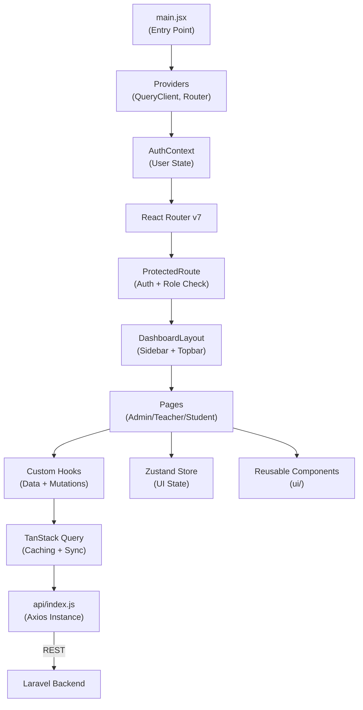
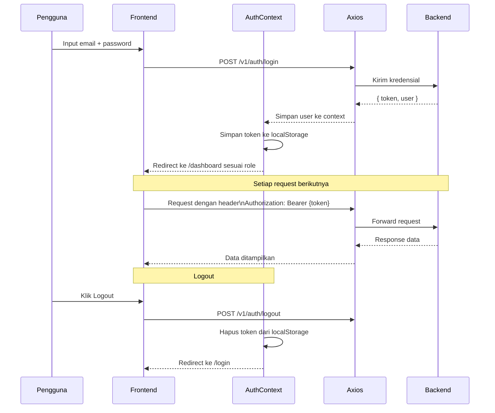

# Frontend — RPL Smart Ecosystem

> Antarmuka pengguna berbasis React 19 + Vite 8 dengan tema **Retro Futuristic** untuk sistem manajemen kelas RPL.

---

## Deskripsi Frontend

Frontend RPL Smart Ecosystem dibangun menggunakan **React 19** dengan build tool **Vite 8**. Tampilan mengusung tema *Retro Futuristic* (Y2K / Sticker-Bomb aesthetic) yang modern, animatif, dan responsif. Komunikasi dengan backend dilakukan sepenuhnya melalui REST API menggunakan **Axios**, dengan manajemen server state via **TanStack Query** dan client state via **Zustand**.

---

## Tech Stack

| Teknologi | Versi | Fungsi |
|-----------|-------|--------|
| **React** | 19.x | Library utama UI |
| **Vite** | 8.x | Build tool & dev server (HMR) |
| **React Router DOM** | 7.x | Client-side routing & navigation |
| **TanStack Query** | 5.x | Fetching, caching & sinkronisasi server state |
| **Zustand** | 5.x | Global client state (ringan, tanpa boilerplate) |
| **Axios** | 1.x | HTTP client untuk komunikasi API |
| **Framer Motion** | 12.x | Animasi halaman & komponen |
| **TailwindCSS** | 3.x | Utility-first CSS framework |
| **Lucide React** | 1.x | Library ikon konsisten |
| **Leaflet + React Leaflet** | 1.9/5.x | Peta interaktif (GPS absensi) |
| **QRCode.react** | 4.x | Render QR Code untuk sesi absensi |
| **Radix UI Dialog** | 1.x | Komponen dialog aksesibel |
| **clsx + tailwind-merge** | — | Class name utilities |

---

## Struktur Folder Frontend

```
frontend/
├── public/                     # Asset statis (favicon, gambar publik)
├── src/
│   ├── api/                    # Layer HTTP client
│   │   ├── index.js            # Instansi Axios + interceptor token
│   │   └── auth.js             # Fungsi autentikasi (login, logout, isTokenExpiring)
│   │
│   ├── assets/                 # Gambar, font, dan asset lokal
│   │
│   ├── components/             # Komponen UI reusable
│   │   └── ui/                 # Komponen UI dasar bertema retro
│   │       ├── RetroDesktopTopbar.jsx   # Topbar navigasi atas
│   │       ├── RetroCard.jsx            # Card container retro
│   │       ├── RetroButton.jsx          # Tombol dengan style retro
│   │       ├── RetroModal.jsx           # Modal dialog retro
│   │       ├── RetroTable.jsx           # Tabel data retro
│   │       ├── RetroInput.jsx           # Input field retro
│   │       ├── RetroBadge.jsx           # Badge/chip retro
│   │       └── ...                      # Komponen UI lainnya
│   │
│   ├── context/                # React Context API
│   │   └── AuthContext.jsx     # Context autentikasi (user, login, logout)
│   │
│   ├── hooks/                  # Custom React Hooks (15 hook)
│   │   ├── useClassFilters.js      # Filter & search data kelas
│   │   ├── useClassForm.js         # Form state manajemen kelas
│   │   ├── useClassMutations.js    # Mutation CRUD kelas
│   │   ├── useClassUI.js           # State UI manajemen kelas
│   │   ├── useDashboardActions.js  # Aksi dashboard
│   │   ├── useDashboardData.js     # Fetch data dashboard
│   │   ├── useQueryPerformance.js  # Monitoring performa query
│   │   ├── useScheduleFilters.js   # Filter jadwal
│   │   ├── useScheduleForm.js      # Form jadwal
│   │   ├── useScheduleMutations.js # Mutation CRUD jadwal
│   │   ├── useScheduleUI.js        # State UI jadwal
│   │   ├── useUserAPI.js           # API calls manajemen user
│   │   ├── useUserFilters.js       # Filter & search user
│   │   ├── useUserForm.js          # Form state user
│   │   └── useUserMutations.js     # Mutation CRUD user
│   │
│   ├── i18n/                   # Internasionalisasi (Bahasa Indonesia/Inggris)
│   │
│   ├── layouts/                # Layout wrapper halaman
│   │   ├── DashboardLayout.jsx # Layout utama dengan sidebar & topbar
│   │   └── AuthLayout.jsx      # Layout halaman login/register
│   │
│   ├── lib/                    # Helper & utility functions
│   │   ├── utils.js            # Fungsi utilitas umum (cn, format, dll)
│   │   ├── errorBoundary.jsx   # Error Boundary React
│   │   ├── activityLogger.js   # Logging aktivitas pengguna
│   │   └── security.js         # Validasi input, sanitasi, CSRF
│   │
│   ├── pages/                  # Halaman-halaman aplikasi
│   │   ├── LandingPage.jsx     # Halaman utama publik
│   │   ├── LoginPage.jsx       # Halaman login
│   │   ├── admin/              # Halaman khusus Admin
│   │   │   ├── UserManagement.jsx       # Manajemen pengguna
│   │   │   ├── ClassManagement.jsx      # Manajemen kelas
│   │   │   ├── SubjectManagement.jsx    # Manajemen mata pelajaran
│   │   │   ├── ScheduleManagement.jsx   # Manajemen jadwal
│   │   │   ├── PKLManagement.jsx        # Manajemen PKL
│   │   │   ├── SettingsPage.jsx         # Pengaturan sistem
│   │   │   ├── AdminStudents.jsx        # Data siswa
│   │   │   ├── AdminTeachers.jsx        # Data guru
│   │   │   ├── AdminAnnouncements.jsx   # Pengumuman admin
│   │   │   ├── AdminReports.jsx         # Laporan & analitik
│   │   │   ├── AdminSecurity.jsx        # Pengaturan keamanan
│   │   │   ├── AdminProfile.jsx         # Profil admin
│   │   │   └── components/              # Komponen spesifik admin
│   │   │       ├── ScheduleFormModal.jsx
│   │   │       ├── ScheduleViewModal.jsx
│   │   │       ├── ScheduleConfirmModals.jsx
│   │   │       ├── ScheduleHeader.jsx
│   │   │       ├── ScheduleListView.jsx
│   │   │       └── UserFormHelpers.jsx
│   │   │
│   │   ├── dashboard/          # Dashboard per role
│   │   │   ├── AdminDashboard.jsx      # Dashboard admin
│   │   │   ├── TeacherDashboard.jsx    # Dashboard guru
│   │   │   ├── StudentDashboard.jsx    # Dashboard siswa
│   │   │   ├── AttendancePage.jsx      # Halaman absensi (check-in flow)
│   │   │   └── student/                # Halaman khusus siswa
│   │   │       ├── StudentQRScan.jsx        # Scan QR absensi
│   │   │       └── StudentAttendancePage.jsx # Form absensi lengkap
│   │   │
│   │   └── teacher/            # Halaman khusus Guru
│   │       ├── TeacherAttendance.jsx   # Manajemen absensi guru
│   │       ├── TeacherPermissions.jsx  # Approve/reject izin
│   │       ├── TeacherSchedules.jsx    # Jadwal mengajar
│   │       ├── TeacherStudents.jsx     # Data siswa per kelas
│   │       ├── TeacherGrades.jsx       # Nilai siswa
│   │       ├── TeacherMaterials.jsx    # Materi pelajaran
│   │       ├── TeacherMessages.jsx     # Pesan
│   │       ├── TeacherAnnouncements.jsx # Pengumuman
│   │       ├── TeacherReports.jsx      # Laporan absensi
│   │       ├── TeacherProfile.jsx      # Profil guru
│   │       └── TeacherSettings.jsx     # Pengaturan akun guru
│   │
│   ├── utils/                  # Fungsi utilitas
│   │
│   ├── routes.jsx              # Konfigurasi routing lengkap (623 baris)
│   ├── main.jsx                # Entry point React + Provider setup
│   ├── App.css                 # CSS global
│   ├── index.css               # CSS utama + custom properties retro
│   ├── design-system.css       # Design system tokens
│   ├── theme.js                # Konfigurasi tema
│   └── ui-config.js            # Konfigurasi UI
│
├── dist/                       # Output build production
├── index.html                  # HTML entry point
├── vite.config.js              # Konfigurasi Vite
├── tailwind.config.js          # Konfigurasi TailwindCSS
├── postcss.config.js           # Konfigurasi PostCSS
├── eslint.config.js            # Konfigurasi ESLint
└── package.json                # Dependencies & scripts
```

---

## Arsitektur Frontend



### Layer Architecture

| Layer | File | Tanggung Jawab |
|-------|------|----------------|
| **Entry** | `main.jsx` | Setup Provider, QueryClient, Router |
| **Routing** | `routes.jsx` | Definisi route, Protected Route, Role Guard |
| **Layout** | `layouts/` | Struktur halaman (sidebar, topbar, content) |
| **Pages** | `pages/` | Halaman per fitur, orkestrasi komponen |
| **Hooks** | `hooks/` | Logika bisnis, API calls, state |
| **Components** | `components/ui/` | UI reusable, presentational |
| **API** | `api/` | Axios instance + auth helpers |
| **Context** | `context/` | Global auth state |
| **Lib** | `lib/` | Security, error handling, logging |

---

## Routing

Semua route didefinisikan di [`src/routes.jsx`](file:///c:/xampp/htdocs/smart-class/frontend/src/routes.jsx).

### Route Publik

| Path | Komponen | Deskripsi |
|------|----------|-----------|
| `/` | `LandingPage` | Halaman utama publik |
| `/login` | `LoginPage` | Halaman login |

### Route Admin (memerlukan role: `admin`)

| Path | Komponen | Deskripsi |
|------|----------|-----------|
| `/dashboard` | `AdminDashboard` | Dashboard utama admin |
| `/admin/users` | `UserManagement` | Manajemen semua pengguna |
| `/admin/classes` | `ClassManagement` | Manajemen kelas |
| `/admin/subjects` | `SubjectManagement` | Manajemen mata pelajaran |
| `/admin/schedules` | `ScheduleManagement` | Manajemen jadwal |
| `/admin/pkl` | `PKLManagement` | Manajemen PKL |
| `/admin/students` | `AdminStudents` | Data lengkap siswa |
| `/admin/teachers` | `AdminTeachers` | Data lengkap guru |
| `/admin/announcements` | `AdminAnnouncements` | Kelola pengumuman |
| `/admin/reports` | `AdminReports` | Laporan & analitik |
| `/admin/security` | `AdminSecurity` | Pengaturan keamanan |
| `/admin/settings` | `SettingsPage` | Pengaturan sistem |
| `/admin/profile` | `AdminProfile` | Profil akun admin |

### Route Guru (memerlukan role: `guru`)

| Path | Komponen | Deskripsi |
|------|----------|-----------|
| `/dashboard` | `TeacherDashboard` | Dashboard guru |
| `/teacher/attendance` | `TeacherAttendance` | Kelola absensi & sesi QR |
| `/teacher/permissions` | `TeacherPermissions` | Approve/reject izin siswa |
| `/teacher/schedules` | `TeacherSchedules` | Jadwal mengajar |
| `/teacher/students` | `TeacherStudents` | Data siswa per kelas |
| `/teacher/grades` | `TeacherGrades` | Input & lihat nilai |
| `/teacher/materials` | `TeacherMaterials` | Upload materi pelajaran |
| `/teacher/messages` | `TeacherMessages` | Pesan |
| `/teacher/announcements` | `TeacherAnnouncements` | Buat pengumuman |
| `/teacher/reports` | `TeacherReports` | Laporan absensi |
| `/teacher/profile` | `TeacherProfile` | Profil akun guru |
| `/teacher/settings` | `TeacherSettings` | Pengaturan akun |

### Route Siswa (memerlukan role: `siswa`)

| Path | Komponen | Deskripsi |
|------|----------|-----------|
| `/dashboard` | `StudentDashboard` | Dashboard siswa |
| `/dashboard/student/qrscan` | `StudentQRScan` | Input kode QR dari guru |
| `/dashboard/student/attendance` | `StudentAttendancePage` | Form absensi (GPS + selfie) |

---

## State Management

### TanStack Query — Server State

Digunakan untuk semua data yang berasal dari API backend.

```js
// Contoh penggunaan di custom hook
const { data, isLoading, error } = useQuery({
  queryKey: ['users', filters],
  queryFn: () => api.get('/v1/admin/users', { params: filters }),
  staleTime: 5 * 60 * 1000, // 5 menit cache
});

const mutation = useMutation({
  mutationFn: (data) => api.post('/v1/admin/users', data),
  onSuccess: () => queryClient.invalidateQueries(['users']),
});
```

**Query Keys yang Digunakan:**

| Key | Data |
|-----|------|
| `['users']` | Daftar pengguna |
| `['classes']` | Daftar kelas |
| `['subjects']` | Daftar mata pelajaran |
| `['schedules']` | Daftar jadwal |
| `['dashboard']` | Data dashboard |
| `['attendance-sessions']` | Sesi absensi |
| `['permissions']` | Data izin |

### Zustand — Client State

Digunakan untuk UI state yang tidak perlu di-sync dengan server.

```js
// Contoh: UI state untuk modal, filter, pagination
const useClassUI = () => {
  const [isModalOpen, setModalOpen] = useState(false);
  const [selectedClass, setSelectedClass] = useState(null);
  // ...
};
```

### AuthContext — Auth State

Menyimpan data user yang sedang login, loading state, dan fungsi login/logout.

```js
const { user, loading, login, logout } = useAuth();
```

---

## Authentication Flow



---

## UI/UX Guidelines

### Palet Warna (Retro Futuristic)

| Token | Hex | Penggunaan |
|-------|-----|-----------|
| `retro-orange` | `#FF5C00` | Aksi utama, CTA, highlight |
| `retro-blue` | `#2E2BBF` | Informasi, link, secondary |
| `retro-yellow` | `#FFC928` | Warning, badge, aksen |
| `retro-pink` | `#FF2D78` | Error, notifikasi penting |
| `base-black` | `#1A1A1A` | Teks utama, border |
| `base-white` | `#FFFFFF` | Background card |
| `base-cream` | `#FFF8F0` | Background halaman |

### Tipografi

| Jenis | Font | Penggunaan |
|-------|------|-----------|
| Heading | `Space Grotesk` / Retro Display | Judul halaman, heading besar |
| Body | `Inter` | Teks konten |
| Monospace | `JetBrains Mono` / Retro Mono | Kode, badge, label teknis |

### Spacing & Layout

- Breakpoint mobile: `< 768px` — Sidebar tersembunyi, layout vertikal
- Breakpoint tablet: `768px–1024px` — Sidebar collapsible
- Breakpoint desktop: `> 1024px` — Sidebar penuh, layout optimal
- Border radius: `4px` (retro style, tidak terlalu rounded)
- Box shadow: `4px 4px 0px #1A1A1A` (retro hard shadow)

### Animasi (Framer Motion)

| Animasi | Trigger | Durasi |
|---------|---------|--------|
| Page transition | Route change | 400ms ease |
| Card hover | Mouse hover | 150ms |
| Modal open/close | State change | 200ms |
| Loading spinner | Data fetching | Infinite rotate |
| Float animation | Idle decorative | 4s loop |

---

## Komponen Utama

### `DashboardLayout`
Wrapper layout utama yang memuat sidebar navigasi dan topbar. Mengelola state sidebar (open/collapsed) dan menampilkan konten halaman.

### `ProtectedRoute`
Komponen guard yang memeriksa:
1. Apakah user sudah login (ada token)
2. Apakah role user sesuai dengan yang diizinkan
3. Menampilkan `RetroLoadingSpinner` saat loading
4. Menampilkan `RetroAccessDenied` jika role tidak sesuai

### `RetroDesktopTopbar`
Topbar atas yang menampilkan nama halaman, notifikasi, info user, dan tombol logout.

### `RetroCard`
Container card dengan style retro (border tebal + hard shadow). Digunakan di seluruh halaman sebagai wrapper konten.

### `TeacherAttendance`
Halaman paling kompleks — mengelola sesi absensi, generate QR, monitoring real-time, verifikasi manual, dan export.

### `StudentQRScan`
Input kode 6 karakter dari guru. Setelah kode valid, redirect ke form absensi lengkap (GPS + selfie).

---

## API Integration

Semua komunikasi ke backend menggunakan **Axios instance** terpusat di [`src/api/index.js`](file:///c:/xampp/htdocs/smart-class/frontend/src/api/index.js).

```js
// src/api/index.js (konsep)
import axios from 'axios';

const api = axios.create({
  baseURL: import.meta.env.VITE_API_URL,
  headers: { 'Content-Type': 'application/json' },
});

// Request interceptor — tambah token otomatis
api.interceptors.request.use((config) => {
  const token = localStorage.getItem('token');
  if (token) config.headers.Authorization = `Bearer ${token}`;
  return config;
});

// Response interceptor — handle 401/403
api.interceptors.response.use(
  (response) => response,
  (error) => {
    if (error.response?.status === 401) {
      // Token expired → logout
      localStorage.removeItem('token');
      window.location.href = '/login';
    }
    return Promise.reject(error);
  }
);
```

**Endpoint yang Digunakan:**

```
Auth:       POST /v1/auth/login
            POST /v1/auth/logout
            GET  /v1/auth/me

Admin:      GET/POST/PUT/DELETE /v1/admin/users
            GET/POST/PUT/DELETE /v1/admin/classes
            GET/POST/PUT/DELETE /v1/admin/subjects
            GET/POST/PUT/DELETE /v1/admin/schedules
            GET/POST/PUT/DELETE /v1/admin/pkl-locations
            GET/PUT /v1/admin/settings
            GET /v1/admin/analytics/*

Guru:       GET /v1/teacher/dashboard
            POST /v1/teacher/attendance/session/create
            POST /v1/teacher/attendance/session/{id}/generate-code
            GET/POST/PATCH /v1/teacher/permissions
            GET /v1/teacher/notifications

Siswa:      GET /v1/student/dashboard
            POST /v1/student/attendance
            GET /v1/student/attendance/history
            GET/POST /v1/student/permissions
            GET/POST /v1/student/projects
```

---

## Error Handling

### Error Boundary

Komponen `ErrorBoundary` di `src/lib/errorBoundary.jsx` menangkap error React yang tidak tertangani dan menampilkan halaman fallback retro.

### API Error Handling

```js
try {
  const response = await api.post('/v1/admin/users', data);
  toast.success('User berhasil dibuat');
} catch (error) {
  const message = error.response?.data?.message || 'Terjadi kesalahan';
  toast.error(message);
}
```

### HTTP Status Mapping

| Status | Penanganan |
|--------|-----------|
| `401` | Auto logout + redirect ke `/login` |
| `403` | Tampilkan pesan "Akses ditolak" |
| `422` | Tampilkan validasi error per field |
| `404` | Tampilkan pesan data tidak ditemukan |
| `500` | Tampilkan pesan error server umum |

---

## Loading State

Setiap halaman menampilkan skeleton atau spinner saat data sedang dimuat:

```jsx
const { data, isLoading } = useQuery(...);

if (isLoading) return <RetroLoadingSpinner />;
```

**Jenis Loading State:**
- `RetroLoadingSpinner` — Spinner penuh layar saat inisialisasi
- Skeleton Card — Placeholder card saat data list dimuat
- Tombol disabled + spinner — Saat form sedang di-submit

---

## Form Validation

Validasi dilakukan di sisi frontend **sebelum** data dikirim ke API:

```js
// Contoh validasi form user
const validateForm = (data) => {
  const errors = {};
  if (!data.name) errors.name = 'Nama wajib diisi';
  if (!data.email?.includes('@')) errors.email = 'Email tidak valid';
  if (data.password?.length < 8) errors.password = 'Password minimal 8 karakter';
  return errors;
};
```

**Aturan Validasi Umum:**
- Email: format valid (`email@domain.com`)
- Password: minimal 8 karakter
- Nama: minimal 3 karakter, maksimal 100 karakter
- Nomor telepon: 10–15 digit angka
- Tanggal: tidak boleh sebelum hari ini (untuk izin)
- Kode QR: tepat 6 karakter uppercase

---

## Security Frontend

| Aspek | Implementasi |
|-------|-------------|
| **Token Storage** | `localStorage` dengan flag HttpOnly (backend) |
| **CSRF Token** | Header `X-CSRF-TOKEN` dikirim setiap request |
| **Input Sanitasi** | Strip HTML tags sebelum dikirim ke API |
| **Role Guard** | `ProtectedRoute` validasi role sebelum render halaman |
| **QR Security** | Tombol generate QR dihapus dari halaman siswa |
| **XSS Prevention** | Tidak menggunakan `dangerouslySetInnerHTML` |
| **Error Masking** | Pesan error generik untuk kesalahan sensitif |

---

## Environment Variables

Buat file `frontend/.env` berdasarkan contoh berikut:

```env
# URL API Backend (wajib)
VITE_API_URL=http://localhost/api

# Nama Aplikasi (opsional)
VITE_APP_NAME=RPL Smart Ecosystem

# Versi Aplikasi (opsional)
VITE_APP_VERSION=2.0.0
```

> **Catatan:** Semua variabel environment frontend harus diawali dengan `VITE_` agar dapat diakses via `import.meta.env.VITE_*`.

---

## Menjalankan Project

```bash
# Masuk ke folder frontend
cd frontend

# Install dependencies
npm install

# Jalankan development server (HMR aktif)
npm run dev
# → Berjalan di http://localhost:5173

# Cek lint
npm run lint

# Preview build production
npm run preview
```

---

## Build Production

```bash
# Build untuk production
npm run build

# Output berada di folder dist/
# Upload isi dist/ ke web server / CDN
```

Output build:

```
dist/
├── index.html              # Entry HTML
├── assets/
│   ├── index-*.css         # CSS bundle (~95 KB)
│   ├── vendor-*.js         # React + library (~386 KB)
│   ├── vendor_libs-*.js    # Library lain (~195 KB)
│   └── index-*.js          # App bundle (~623 KB)
```

---

## Deployment Frontend

### Via Static Hosting (Netlify / Vercel)

```bash
npm run build
# Upload folder dist/ atau connect repository
# Set VITE_API_URL ke URL backend production
```

### Via Nginx

```nginx
server {
    listen 80;
    server_name rpl-smart.example.com;
    root /var/www/smart-class/frontend/dist;
    index index.html;

    # SPA fallback — semua route ke index.html
    location / {
        try_files $uri $uri/ /index.html;
    }

    # Cache asset statis
    location /assets {
        expires 1y;
        add_header Cache-Control "public, immutable";
    }
}
```

### Via Apache (XAMPP — Development)

Buat file `.htaccess` di folder `dist/`:

```apache
Options -MultiViews
RewriteEngine On
RewriteCond %{REQUEST_FILENAME} !-f
RewriteRule ^ index.html [QSA,L]
```

---

## Troubleshooting Frontend

| # | Masalah | Solusi |
|---|---------|--------|
| 1 | `npm install` gagal | Hapus `node_modules` dan `package-lock.json`, jalankan ulang `npm install` |
| 2 | Halaman putih setelah login | Buka DevTools Console, cek error JavaScript; biasanya import path salah |
| 3 | API request gagal (Network Error) | Pastikan backend berjalan dan `VITE_API_URL` benar di `.env` |
| 4 | CORS error di browser | Pastikan `SANCTUM_STATEFUL_DOMAINS` backend sudah include `localhost:5173` |
| 5 | Token tidak tersimpan | Pastikan localStorage tidak diblokir; cek private/incognito mode |
| 6 | Halaman tidak redirect setelah login | Cek `AuthContext` — pastikan `user` state terupdate setelah login |
| 7 | QR Code tidak muncul | Pastikan guru sudah buat sesi absensi; cek endpoint `generate-code` |
| 8 | GPS tidak bisa diakses | Izinkan akses lokasi di browser; HTTPS wajib untuk production |
| 9 | Peta Leaflet tidak muncul | Import CSS Leaflet wajib ada: `import 'leaflet/dist/leaflet.css'` |
| 10 | Hot reload (HMR) tidak berfungsi | Restart `npm run dev`; pastikan tidak ada proses lain di port 5173 |
| 11 | Build gagal karena import error | Periksa semua path import — gunakan alias `@/` sebagai ganti `../../` |
| 12 | Data tabel tidak muncul | Buka Network tab DevTools, cek response API apakah 200 OK |
| 13 | Modal tidak bisa ditutup | Cek apakah ada z-index conflict; pastikan `onClose` prop terpasang |
| 14 | State tidak update setelah mutasi | Pastikan `queryClient.invalidateQueries()` dipanggil setelah mutasi |
| 15 | Animasi patah di mobile | Gunakan `will-change: transform` dengan bijak; kurangi animasi kompleks |
| 16 | Font tidak muncul | Periksa apakah Google Fonts atau font lokal sudah di-import di `index.css` |
| 17 | Tailwind class tidak berlaku | Pastikan path file sudah ada di `tailwind.config.js` `content` array |
| 18 | Halaman /admin blank untuk siswa | Ini normal — `ProtectedRoute` memblokir akses lintas role |
| 19 | Refresh halaman redirect ke login | Pastikan token belum expired; cek `isTokenExpiring` di `auth.js` |
| 20 | `npm run build` lebih lambat dari biasa | Normal untuk pertama kali; selanjutnya ada cache Vite di `node_modules/.vite` |
